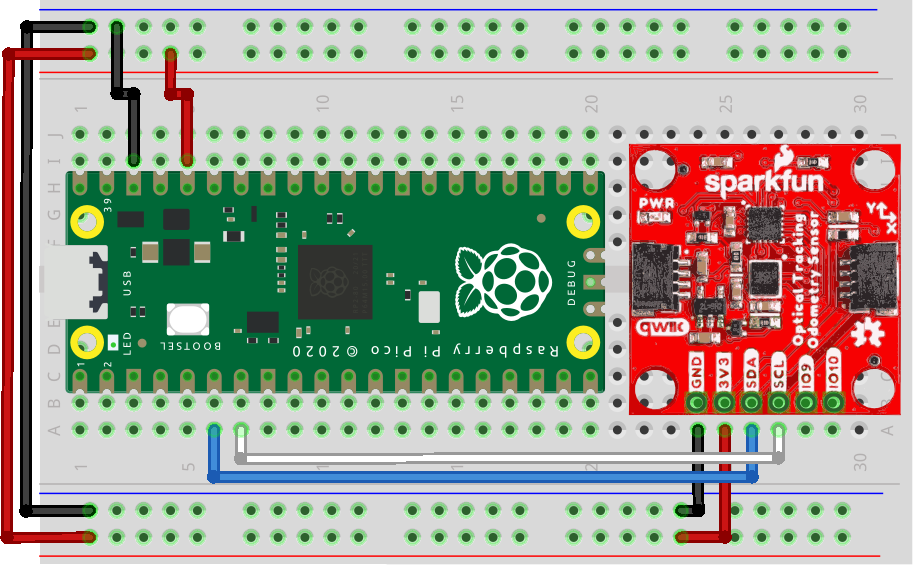

# PAA5160E1 Raspberry Pi Pico RP2040 Library

This library is a refactoring of [SparkFun_Qwiic_OTOS_Arduino_Library](https://github.com/sparkfun/SparkFun_Qwiic_OTOS_Arduino_Library) to make the [SparkFun Optical Tracking Odometry Sensor - PAA5160E1 (Qwiic)](https://www.sparkfun.com/products/24904) compatible with the Raspberry Pi Pico RP2040 SDK. 

## Description

This library was designed to work in I2C with the PAA5160E1.
By default the i2c0 and the GP4 and GP5 are used in this project.


<p align="center" style="color:gray;">Raspberry Pi Pico connected using I2C to the PAA5160E1 - Schematic created with Fritzing</p>

## Motivation

By not using Arduino but rather the Raspberry Pi Pico SDK, I set out to port the Arduino library from SparkFun.

## Project Structure

The project is structured as follows:

```
Qwiic_OTOS_Library
├── assets
├── CMakeLists.txt
├── include
│   ├── QwiicOtos.h
│   ├── sfeQwiicOtos.h
│   └── utils.h
├── LICENSE
├── README.md
└── src
    ├── sfeQwiicOtos.cpp
    └── utils.cpp
```

The specification of Raspberry Pi Pico pins used for I2C, with I2C0 being the default, and the ability to set the I2C baud rate, are defined in utils.h:
```
Qwiic_OTOS_Library
└── include
    └── utils.h
```

## Requirements
- [piko-sdk](https://github.com/raspberrypi/pico-sdk)

## Installation

To use this library, clone the repository into your Raspberry Pi Pico RP2040 project directory:

```bash
git clone https://github.com/robotcopper/PAA5160E1_Pico_Library.git
```

Then include it in your project's CMakeLists.txt file:

```cmake
add_subdirectory(
	PAA5160E1_Pico_Library
)

target_link_libraries(main
    Qwiic_OTOS_Library
)
```

## Usage

Here's a simple example demonstrating how to use the library to initialize the sensor and read odom data:

```cpp
#include "QwiicOtos.h"

initI2C(false);
// Calibrate the IMU, which removes the accelerometer and gyroscope offsets
myOtos.calibrateImu();
// Set the desired units meters for linear, and radians for angular.
myOtos.setLinearUnit(kSfeOtosLinearUnitMeters);
myOtos.setAngularUnit(kSfeOtosAngularUnitRadians);
// Reset the tracking algorithm - this resets the position to the origin,
// but can also be used to recover from some rare tracking errors
myOtos.resetTracking();

while (true) {

    sfe_otos_pose2d_t pos;
    myOtos.getPosition(pos);

    printf("x: %.2f m, y: %.2f m, h: %.2f rad \n", pos.x, pos.y, pos.h);

}

```

## Credits and Contributions

**Original Developer:** <br>

   &nbsp;&nbsp; **SparkFun** :  <br>
   &nbsp;&nbsp;&nbsp;&nbsp; **Links** :
   - Link to SparkFun_Qwiic_OTOS_Arduino_Library GitHub repository: [SparkFun_Qwiic_OTOS_Arduino_Library](https://github.com/sparkfun/SparkFun_Qwiic_OTOS_Arduino_Library)

## License

The modifications made to **SparkFun**'s work are licensed under the [BSD 3-Clause License](LICENSE).
